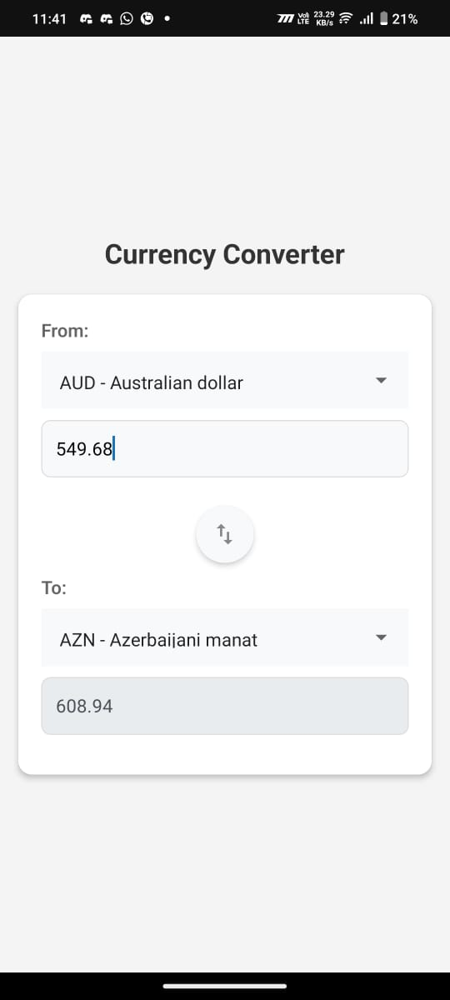
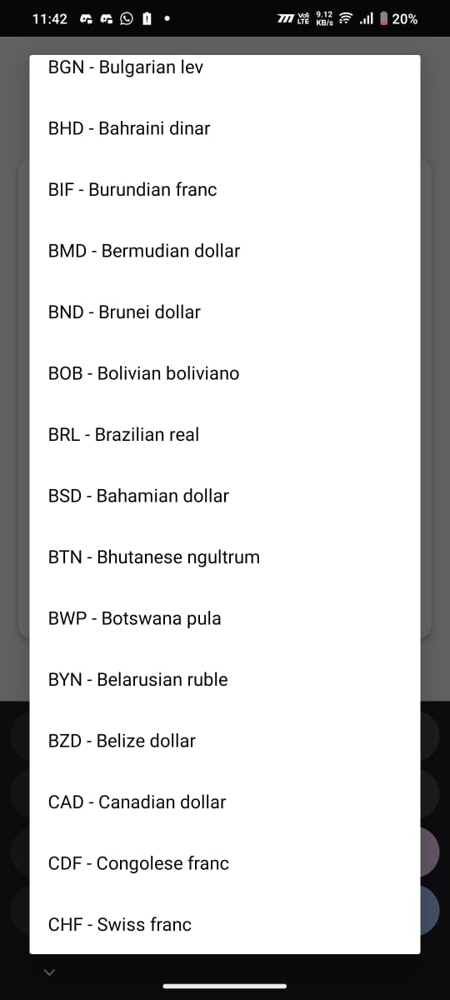

# CashX (Currency Converter)

This is an Currency converting project created by using expo react native SDK 52.

## Get started

1. Clone this repo to local system

   ```
   git clone <repo_link>
   ```

   **replace <repo_link> with the actual link**

2. Install dependencies

   ```
   npm install
   ```

3. Generate Native directories

   ```
    npx expo prebuild --clean
   ```

4. Make sure you have setup Android studio/Xcode, if you are using physical devices connect with USB and enael USB debugging in developer options. Then run

   ```
   //for android
   npx expo run:android

   //for ios
   npx expo run:ios
   ```

   you can also use Expo Go sandbox, but it is not recommended because the Expo Secure Store will be cleared automatically every time we reopen the app

   for Expo Go

   ```
   npx expo start
   ```

**Note: You may encounter some issue due to latest Expo SDK 52**

Refer [Expo Official Docs](https://docs.expo.dev/get-started/set-up-your-environment/) for setuping environment if you encounter any issue.

## Screenshots



